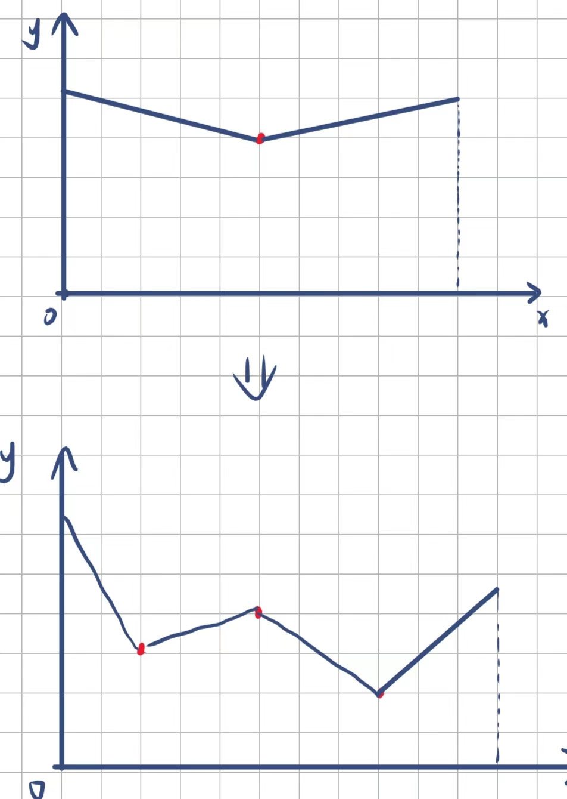

<script type="text/javascript" src="http://cdn.mathjax.org/mathjax/latest/MathJax.js?config=TeX-AMS-MML_HTMLorMML"></script>
<script type="text/x-mathjax-config">
    MathJax.Hub.Config({ tex2jax: {inlineMath: [['$', '$']]}, messageStyle: "none" });
</script>

# PDF

## Introduction

在第二本书中，我们构建了`Cornell Box`和`Final Scene`等`Background`为黑色，且光源较小，亮度较低的场景，

我们发现，在渲染得到的图片中，出现了很多的噪点。与使用相机拍摄照片时可能由于过高ISO放大电路噪声和光信号放大时失真产生的噪点，虽然结构类似，但是成因不同。

回顾之前完成的代码，我们为了模拟Lambertian表面，我们使用了`random_unit_vector()`函数来辅助生成随机的反射光线。而当场景较暗时，存在较高的概率反射光线最后没有抵达光源。

这时，若我们采样率较低的话，每一个像素的颜色和亮度都会存在较大的偶然性，最终导致相邻的像素差别较大，且随机性很强，出现噪点。

在生成`Final Scene`时，我们将采样数从100左右调至10000来降噪，这使得CPU的负荷空前地高涨，任劳任怨地工作了5个小时，却也只得到了一张勉强看得过去的图片。

我们需要一个效率更高的方法，来使得在维持现有采样数的前提下，提升图片的质量。

**So, what should we do?**

## More Ray To Light

万幸的是，作者心善地为我们指明了方向，我们可以通过尽可能地让反射光线指向光源方向来降低敏感差距，使得光线的颜色在同一表面具有一致性，从而减少噪点。

以下是关于这一观点的一个简单的数学证明：

设想一个表面上的点 $𝑃$， 其法向量为 $𝑁$， 光源方向为 $𝐿$ ，反射光线方向为 $𝑅$ ，反射光线与光源方向的夹角为 $\theta$。

在光线追踪中，反射光线的贡献可以表示为：

$I = I_0 \cdot \cos(\theta)$

其中$I_0$为入射光强度， $\theta$ 为反射光线与光源方向的夹角。当 $\theta$ 越小时， $\cos(\theta)$ 越接近 1，表明反射光线与光源方向越接近，光强度贡献最大。

故而，对于同一光源，反射光线和光源方向的夹角 $\theta$越小，$\cos(\theta)$的斜率越小，所以每次采样的波动也会更小，从而减少了噪点。

## 概率密度函数：PDF

为了让随机数生成器生成的值符合给定的概率密度函数，数学上，我们可以使用反函数变化法(Inverse Transform Sampling)。

对于给定的概率密度函数$f(x)$，首先计算其累积分布函数$F(x)$:

$F(x) = \int_{-\infty}^{x} f(t) \, dt$

生成一个均匀分布的随机数$u ∈[0, 1]$。

通过求反函数$x = F^{-1}(u)$，得到符合给定概率密度函数的随机数$x$。

## 蒙特卡罗算法

而为了求得对应的积分和反函数，我们可以使用MC方法来求出某一点$x$的$F(x)$，这里给出

$I = \int_{0}^{2} x^2\, dx$

的生成作为示例。

```c++
int main() 
{
    int N = 1000000;
    auto sum = 0.0;
    for (int i = 0; i < N; i++) 
    {
        auto x = random_double(0,2);
        sum += x*x;
    }
    std::cout << std::fixed << std::setprecision(12);
    std::cout << "I = " << 2.0 * (sum/(float)N) << '\n';
}
```

而对于反函数，对于某一点，我们可以使用反向插值来获取近似估计：

```c++
#include <iostream>
#include <vector>
#include <algorithm>

struct Point {
    double x;
    double y;
};

double linearInterpolate(double x0, double y0, double x1, double y1, double x) {
    return y0 + (y1 - y0) * ((x - x0) / (x1 - x0));
}

double inverseCDF(const std::vector<Point>& cdf, double u) {
    if (u < cdf.front().y || u > cdf.back().y) {
        throw std::out_of_range("u is out of the range of the CDF");
    }

    for (size_t i = 1; i < cdf.size(); ++i) {
        if (u <= cdf[i].y) {
            return linearInterpolate(cdf[i-1].y, cdf[i-1].x, cdf[i].y, cdf[i].x, u);
        }
    }

    return cdf.back().x;
}

int main() {
    std::vector<Point> cdf = {
        {0.0, 0.0},
        {0.1, 0.001},
        {0.2, 0.008},
        {0.3, 0.027},
        {0.4, 0.064},
        {0.5, 0.125},
        {0.6, 0.216},
        {0.7, 0.343},
        {0.8, 0.512},
        {0.9, 0.729},
        {1.0, 1.0}
    };

    double u = 0.5;
    try {
        double x = inverseCDF(cdf, u);
        std::cout << "F^(-1)(" << u << ") ≈ " << x << std::endl;
    } catch (const std::out_of_range& e) {
        std::cerr << e.what() << std::endl;
    }

    return 0;
}
```

通过如上步骤，我们可以获取一个函数在某一点的积分的反函数的值，出于效率考虑，我们可以使用二分法，在$O(\log N)$的复杂度求出积分的反函数的近似解：



在直接使用上述步骤获取更倾向于光源方向的反射光线时，我们会发现，渲染出来的结果亮度格外的高。理论上来说，确实如此，我们将原本随机的光线集中到了光源上。

故而，为了得到原本的亮度我们需要多进行一步操作：

当我们在一个特定的方向上 $\omega$采样并计算其光线贡献时，这个贡献是根据我们选择的PDF $p(\omega)$采样得到的。为了将采样点的贡献转换为整个积分域上的贡献，我们需要乘以这个方向的反射值并除以其 PDF 值，这样可以消除采样分布带来的偏差，使得期望值正确。

这里的PDF值实际上就是我们后面实践中的`pdf_value`

## PDF Used in Our Project

### SpherePDF

作用：均匀采样球体表面上的方向。

- `value` 方法返回方向均匀分布在球面上的概率密度$\frac{1}{4\pi}$。
- `generate` 方法生成一个随机方向。

### CosinePDF

作用：按照余弦加权采样方向，通常用于采样漫反射方向。

- `value` 方法计算方向的概率密度值，按余弦加权。
- `generate` 方法生成一个按照余弦加权的随机方向。

### HittablePDF

作用：采样可击中的物体表面上的方向。用于光源，可直接生成某点指向光源的光线。

- `value` 方法返回物体表面某个方向的概率密度。递归地由光源的物体类型给出。
- `generate` 方法生成指向物体表面的随机方向。

### MixturePDF

若按照上述方法生成光源的PDF，将会遇到一个问题：我们并不关注不指向光源的光线，因此在构建光源的PDF时需要考虑到漫反射材质本身的影响。为了解决这一问题，可将散射和概率值p加权混合，然后将得到的PDF作为新的光源PDF。

作用：混合两个 PDF，生成组合采样方向。

- `value` 方法返回两个 PDF 的平均概率密度。
- `generate` 方法根据权重随机选择一个 PDF 来生成方向。