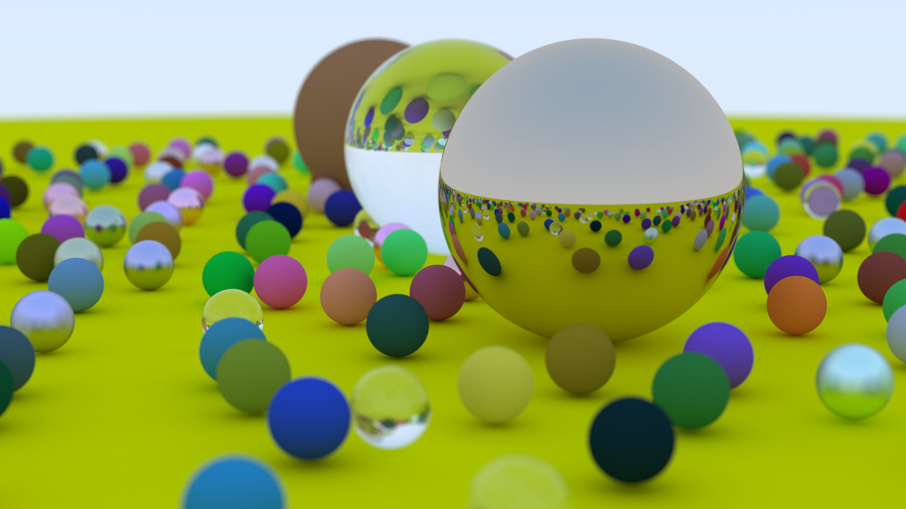
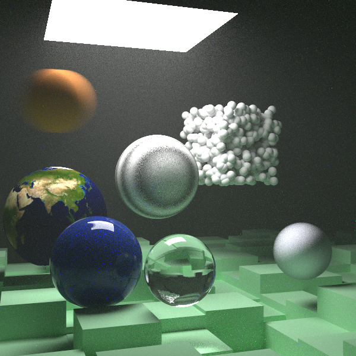
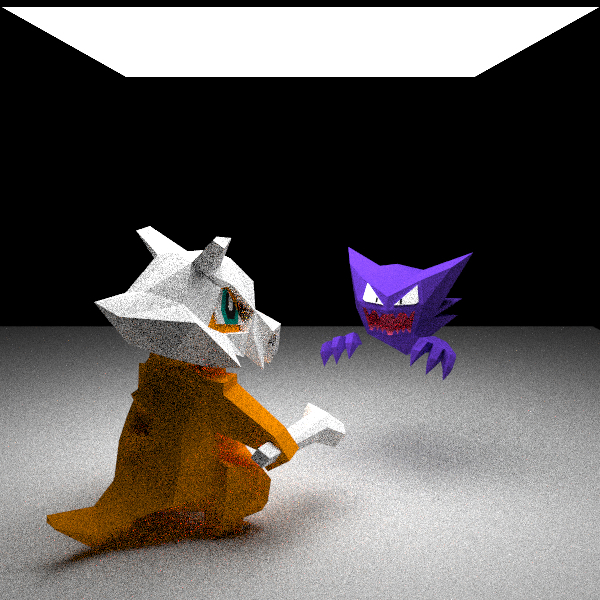
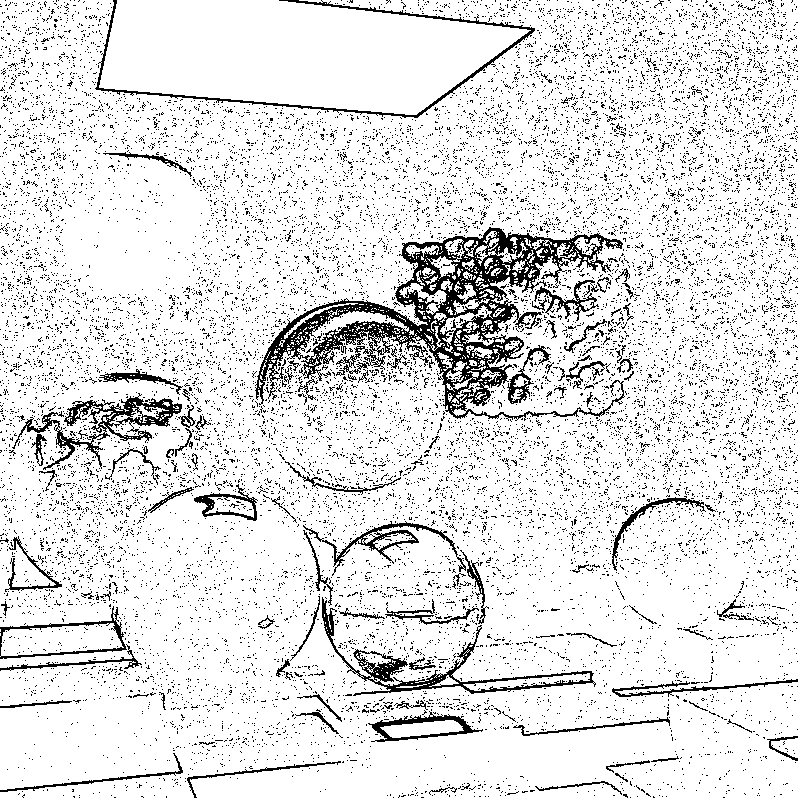
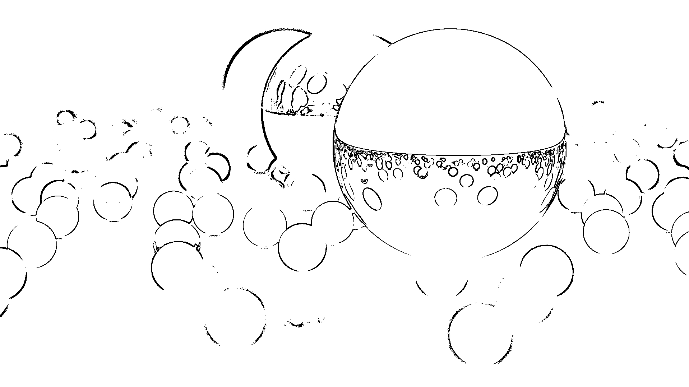

# Ray Tracing

A 2-week object in PPCA of ACMClass-2023





(ps: My `main` function is in a mess, because I'm trying to avoid warning of some fn never used when I need to ignore it sometimes)

---

## Learning Materials

- [*Rust Programming Language*](https://doc.rust-lang.org/book/title-page.html)
- [_Ray Tracing in One Weekend_](https://raytracing.github.io/books/RayTracingInOneWeekend.html)
- [_Ray Tracing: The Next Week_](https://raytracing.github.io/books/RayTracingTheNextWeek.html)
- [_Ray Tracing: The Rest of Your Life_](https://raytracing.github.io/books/RayTracingTheRestOfYourLife.html)

## How it works

Generally, we use road track to generate rays from our `camera` through the `Viewport` (which decide the pixel of the ray contribute to) to the `world`(where you put all you objects ready to form a picture), and bouncing in the scene to decide what color the ray is, and get the color to the image.

The things in the world are `Hittable`, they use `hit` function to decide whether the ray are hitting it. Also, it has a feature called `Material` to tell how the ray should scatter and its `Texture` to tell what color should add to the ray.

Till now, I have finished `Sphere` `Quad` `Triangle` as origin `Hittable`, and `Hittable_list` `Bvh`(make render faster, read book2 for more detail) as container for original `Hittable`.

So we implement functions like hit recursively.

- [PDF report](PDF_Report.md)

## Advanced Feature

### Multitask

### Support for .obj File

Usage example:

```
let obj = read_obj("Haunter.obj", 300.0);
    let obj = RotateY::new(Arc::new(obj), -30.0);
    let obj = Translate::new(Arc::new(obj), &Vec3::new(156.0, 206.0, 300.0));
    world.add(Arc::new(obj));
```

Notice: the obj file should be stored in the `objects/` in **root** of my Ray Tracer

Use tobj to load `.obj` file into `Vec`

[tobj_doc](https://docs.rs/tobj/latest/tobj/)

Use `triangle.rs` to form a poly.

Currently support Lambertian color import.

Example:



### Edge Detection

Firstly I average the R G B with
`let g = 0.299 * pixel[0] as f64 + 0.587 * pixel[1] as f64 + 0.114 * pixel[2] as f64;`
to get the gray image of the origin image.

Then I do Sobel operator on the gray image, and make the part that `> max` black, and the others white. (where `max` is a variable given before running the program)

So we get:



As you can see, the noise is too noisy.

But for the image with less noise, the result is quiet satisfiable.



However, this picture has a very low DOF, so that the edges that too far and too close are blurred, so it could be very hard to distinguish a blurred edge.